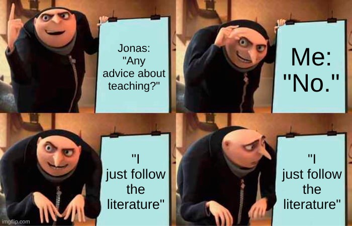

# score_flash_talk_2026

SCoRe flash talk

## Intro

## What caused this talk

## The problem it solves

Gives my three most important guidelines
and the place to do these.

## Why my answer will **not** matter

I may be the most experienced teacher
(20 years, ~3.75 years full-time, +6000 hours)
with formal education at the MSc level.

- Doing a teacher education
  has a below-average (0.36, average is 0.4)
  effect on teaching quality
  `[Hattie, the sequel, table 9.1, p 217]`
- Years of experience has no effect on teaching quality
  `[Gore et al., 2024, Graham et al., 2020]`.

<!--

There is limit evideonce that teaching quality *declines*
for teachers with 4-5 years experience, when compared to the
other two classes: 0-3 and 6+ years of experience
`[Graham et al., 2020]`. 

RJCB: I requested the data, I predict this effect is caused by binning

-->

## Why my answer *may* matter

Intrinsic motivation is the main cause
for teachers to get better (in this case, more efficient)
over time `[Layek and Koodamara, 2024]`.

Maybe [my teaching portfolio](https://richelbilderbeek.github.io/teaching/)
demonstrates that I have that.

## Tip 1: consider to follow the literature

### Problem: our instincts are wrong

We all have our ideas and instincts on good teaching.

As an example, imagine a teacher that believes that
a lecture/monologue of 60 minutes is what the learners need
(he/she fondly remembers university lectures like that).

Our ideas may be wrong. 

### Why this idea is wrong

In this case, the idea is definitely wrong:
already any (?) textbook (that is not too weird) will tell you this.

These textbooks may point you to a big meta-analyses that shows
that lecturing has a **negative** impact on learning `[Hattie, 2023]` <!-- page 363, effect size is -0.26 with a robustness index of 4 out of 5 and is based on 3 meta analyses using 273 studies using 27,296 people, measuring for 614 effects with a standard error of 0.08. -->.

### How wrong this idea is

To get a perspective how negative this is,
here are some other inventions and their values,
from [the Hattie Ranking](https://visible-learning.org/hattie-ranking-influences-effect-sizes-learning-achievement/):

ES   |Description
-----|----------------------------------------
1.29 |Teacher estimates of achievement
1.2  |Jigsaw method
0.82 |Classroom discussion
0.7  |Feedback
0.6  |Direct instruction
0.55 |Cooperative vs. individualistic learning
0.48 |Questioning
0.37 |Worked examples
0.29 |Homework
0.22 |Clickers
0.1  |Background music
0.04 |Humor	
-0.05|Lack of sleep
-0.19|Students feeling disliked
-0.26|**Lecturing**
-0.36|Depression

### Why this knowledge is ignored anyways

This teacher may have the feeling that he/she knows better.

This is a known dynamic: early-career (i.e. less than two years of
full-time teaching) teachers struggle
to combine theory and practice and
focus more on survival `[Admiraal et al., 2023]`.

### Why this knowledge is ignored anyways too

This teacher may have the idea that he/she knows better,
based on some positive evaluation results.

It is known that most evaluation results do not correlate with course
quality (e.g. for 'Course satisfaction', see `[Uttl et al., 2017]`
and 'Rate the course', see `[Clayson, 2009]`).
Based on the literature, it means that a negative evaluation result
may not be as bad as you will feel.

### Tip

Tip: visit the SciLifeLab Teaching Literature Club.

## Tip 2: consider being open on what you are

### Most of us are in survival mode

Most of us are novices in teaching (i.e. less than 2 years of full-time
teaching) and will typically focus on survival
in the initial stage of teaching
(many studies, among many other `[Admiraal et al., 2023]`).

### Most of us desire informal dialogue with colleagues

Novice teachers have the biggest need for 'informal dialogue with colleagues
and participation in an in-class coaching programme' `[Mansfield and Gu, 2019]`.

![`[Mansfield and Gu, 2019]` figure 1: what novice teachers desire most. Survey 2 is a follow-up to the same teachers sent again later](mansfield_and_gu_2019_fig_1.png)

### Mentorship helps to keep novices

We know that mentorship helps to keep teachers:
with mentorship 17.8% drop out,
without mentorship this is 44.9%,
in a period of 5 months `[Crassous et al., 2024]`.

### Experiences teachers keep making mistakes

Experienced teachers may feel that they suffer reputational damage
by trying out new things, as some of these experiments
inevitably fail, even though there is a global urge for
innovation in education `[Moula, 2021]`.

### Tip

Tip: the SciLifeLab training hub or other experienced teachers can help here,
but there is no formally organized mentorship program,
nor (formally organized) informal teacher discussions.

<!--

- you are not perfect, you are only responsible for trying your best
- If you don't care about feedback (yet),
  do not bother the learners by asking for it
- consider sharing your definition of good teaching:
  It gives others a perspective:
  If you think good teaching is 'providing a lot of information',
  then others can understand why you lecture for more than one hour.
  If you think good teaching is 'conveying knowledge and monitoring how
  well this succeeds', then others will help remind you to not
  lecture for more than one hour.

-->

## Tip 3: consider growing as a teacher

### I think you want to grow

I think that teaching is a complex activity
and takes some growth beyond the initial survival
to see this.

### The most important ways to grow

The two most important ways to grow as a teacher
are reflection and peer observations `[Lowyck and Verloop, 1995]`.

### Reflection

Reflection is that you write down your thoughts on how a lesson
went. If you want to see how that may look,
[all of my reflections are public](https://richelbilderbeek.github.io/teaching/teaching_overview/).

### Peer observation

Peer observations is the observation and discussion of lessons
with a colleague **as equals**. To make this work well for you,
choose the observer carefully, as he/she must be able to
resist the urge to compare with his/her
own teaching style `[Siddiqui et al., 2007]`.

Observing a colleague is one of the most desired
activity of novice teachers `[Mansfield and Gu, 2019]`.

Note: everyone is always welcome to observe my lessons (although some
may be quite dull to observe).

### Tip

Tip: the SciLifeLab training hub or other experienced teachers can help here,
but there is no peer observation club anymore.

## Appendix

### The literature  may be incorrect.

- Fun fact: I learned that
  'Humans can focus 20 minutes' is a commonly-held idea
  for which there is no evidence. <!-- Instead, people stopped taking notes after 10-15 minutes, taking notes is unrelated to attention span. Also, another experiment shows that notes are made equally under a lesson. Other papers were invalid too. I believe the paper --> 
  `[Wilson and Korn, 2007]`.
  The 5-10 minutes reported by `[Svinicki, 2014]` indeed is based on
  nothing solid.
  Also, humans can focus six minutes in online classes
  `[Nilson and Goodson, 2021]` has no reference to the literature

<!--
`[Nilson and Goodson, 2021]`
- Students learn new material better and can remember it longer when they learn
  it by engaging in an activity than when they passively watch or listen
  to an instructor talk [8 references] (page 92, item 2)
- [...] long lectures and presentations will fail because students stop
  viewing and listening after about six minutes.
  [...]
  In online classes, such student inattention becomes explicitly visible
  through electronic monitoring of activities and questions
  from students about what has already been covered in a long presentation.
  (page 69, part of 'Choosing online and offline content', 1st paragraph)

-->

Example:

![About `[Boring & Ottoboni, 2016]`](boring_and_ottoboni_2016.jpg)

> In `[Boring & Ottoboni, 2016]` it was reported that females were
> discriminated against, 
> as they received significantly
> lower ratings; 'Gender biases can be large enough to cause
> more effective instructors to get lower SET than less effective instructors'.
> Upon a closer look, only 1% of all variation was explained
> by gender.

## References

- `[Admiraal et al., 2023]` Admiraal, Wilfried et al.,
  "Mind the gap: Early-career teachers’ level of preparedness, professional
  development, working conditions, and feelings of distress".
  Social Psychology of Education 26.6 (2023): 1759-1787.

- `[Boring & Ottoboni, 2016]`
  Boring, Anne, and Kellie Ottoboni.
  "Student evaluations of teaching (mostly)
  do not measure teaching effectiveness." ScienceOpen research (2016).

- `[Clayson, 2009]` Clayson, Dennis E. "Student evaluations of teaching:
  Are they related to what students learn?
  A meta-analysis and review of the literature."
  Journal of marketing education 31.1 (2009): 16-30.

- `[Crassous et al., 2024]`
  Crassous, Jérôme J., Baćani Mirkov, and Jaramillo Franklin.
  "Mentorship Program Effectiveness in Early-Career Teacher Retention:
  Comprehensive Study."
  Global Synthesis in Education Journal 2.5 (2024): 60-77.

- `[Fuller and Bown, 1975]` Fuller, Frances F., and Oliver H. Bown.
  "Becoming a teacher." Teachers College Record 76.6 (1975): 25-52.
  <!-- Does not have the stages -->

- `[Gore et al., 2024]` Gore, Jennifer, et al.
  "Fresh evidence on the relationship between years of experience
  and teaching quality."
  The Australian educational researcher 51.2 (2024): 547-570.
- `[Graham et al., 2020]` Graham, Linda J., et al.
  "Do teachers' years of experience make a difference in the quality of
  teaching?." Teaching and teacher education 96 (2020): 103190.

- `[Hattie, 2023]` Hattie, J. "Visible learning–the Sequel 2023."
  A synthesis of over 2100 meta-analyses (2023).

- `[Layek and Koodamara, 2024]` Layek, Debika, and Navin Kumar Koodamara.
  "Motivation, work experience, and teacher performance: A comparative study."
  Acta psychologica 245 (2024): 104217.

- `[Lowyck and Verloop, 1995]` Lowyck, Joost, and Nico Verloop.
  Onderwijskunde: een kennisbasis voor professionals.
  Wolters-Noordhoff, 1995.

- `[Mansfield and Gu, 2019]` Mansfield, Caroline, and Qing Gu.
  "“I’m finally getting that help that I needed”:
  Early career teacher induction and professional learning".
  The Australian Educational Researcher 46.4 (2019): 639-659.

- `[Moula, 2021]` Moula, Zoe. "Academic perceptions of barriers and facilitators of creative pedagogies in higher education: A cross-cultural study between the UK and China." Thinking skills and creativity 41 (2021): 100923.

- `[Nilson and Goodson, 2021]` Nilson, Linda B., and Ludwika A. Goodson. Online teaching at its best: Merging instructional design with teaching and learning research. John Wiley & Sons, 2021.

- `[Svinicki, 2014]` Svinicki, M. "McKeachie’s Teaching tips: Strategies, research, and theory for college and." Wadsworth, Cengage Learning (2014).

- `[Uttl et al., 2017]`
  Uttl, Bob, Carmela A. White, and Daniela Wong Gonzalez.
  "Meta-analysis of faculty's teaching effectiveness:
  Student evaluation of teaching ratings and student learning are not related."
  Studies in Educational Evaluation 54 (2017): 22-42.

- `[Wilson and Korn, 2007]` Wilson, Karen, and James H. Korn.
  "Attention during lectures: Beyond ten minutes."
  Teaching of Psychology 34.2 (2007): 85-89.

