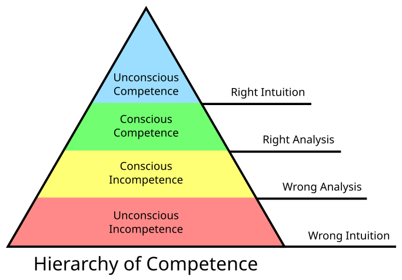

# score_flash_talk_2026

SCoRe flash talk

## Intro

## What caused this talk

## The problem it solves

Gives my three most important guidelines
and the place to do these.

## Why my answer will **not** matter

I may be the most experienced teacher (20 years,
with around 2000 hours of teaching) with formal education at the MSc level.

- Doing a teacher education
  has a below-average (0.36, average is 0.4)
  effect on teaching quality
  `[Hattie, the sequel, table 9.1, p 217]`
- Years of experience has no effect on teaching quality
  `[Gore et al., 2024, Graham et al., 2020]`.

<!--

There is limit evideonce that teaching quality *declines*
for teachers with 4-5 years experience, when compared to the
other two classes: 0-3 and 6+ years of experience
`[Graham et al., 2020]`. 

RJCB: I requested the data, I predict this effect is caused by binning

-->

## Why my answer *may* matter

Intrinsic motivation is the main cause
for teachers to get better (in this case, more efficient)
over time `[Layek and Koodamara, 2024]`.

Maybe [my teaching portfolio](https://richelbilderbeek.github.io/teaching/)
demonstrates that I have that.

## Tip 1: consider to follow the literature

We all have our ideas and instincts on good teaching.
As an example, imagine a teacher that believes that
a lecture/monologue of 60 minutes is what the learners need.

Our ideas may be wrong. 

In this case, the idea is definitely wrong, as big meta-analyses show
that lecturing has a **negative** impact on learning `[Hattie, 2023]` <!-- page 363, effect size is -0.26 with a robustness index of 4 out of 5 and is based on 3 meta analyses using 273 studies using 27,296 people, measuring for 614 effects with a standard error of 0.08. -->.

This teacher may have the idea that he/she knows better.

  - Beginner teachers overestimate themselves

<!-- `[Fuller and Bown, 1975]` does not have the stages, but
Pigge and Marso, 1997

It seems here is where it all started:
- Burch, N., 1970, Conscious competence learning model: Four stages of learning theory-unconscious incompetence to unconscious competence matrix-and other theories and models for learning and change , 

This may be a fine paper:

- Teachers’ professional development shaped through self-reflection using video-stimulated recall
 -->

  - Most evaluation results have no correlation with course quality
- Following the literature helps align your instincts with reality

Tip: teaching literature club

## Tip 2: consider being open on what you are

- you are not perfect, you are only responsible for trying your best
- If you don't care about feedback (yet),
  do not bother the learners by asking for it
- consider sharing your definition of good teaching:
  It gives others a perspective:
  If you think good teaching is 'providing a lot of information',
  then others can understand why you lecture for more than one hour.
  If you think good teaching is 'conveying knowledge and monitoring how
  well this succeeds', then others will help remind you to not
  lecture for more than one hour.

## Tip 3: consider growing as a teacher

The best way to grow as a teacher:
  - Reflect
  - Peer observations

Tip: join the peer observation club

## Appendix

### The literature  may be incorrect.

- Fun fact: I learned that
  'Humans can focus 20 minutes' is a commonly-held idea
  for which there is no evidence. <!-- Instead, people stopped taking notes after 10-15 minutes, taking notes is unrelated to attention span. Also, another experiment shows that notes are made equally under a lesson. Other papers were invalid too. I believe the paper --> 
  `[Wilson and Korn, 2007]`.
  The 5-10 minutes reported by `[Svinicki, 2014]` indeed is based on
  nothing solid.
  Also, humans can focus six minutes in online classes
  `[Nilson and Goodson, 2021]` has no reference to the literature

<!--
`[Nilson and Goodson, 2021]`
- Students learn new material better and can remember it longer when they learn
  it by engaging in an activity than when they passively watch or listen
  to an instructor talk [8 references] (page 92, item 2)
- [...] long lectures and presentations will fail because students stop
  viewing and listening after about six minutes.
  [...]
  In online classes, such student inattention becomes explicitly visible
  through electronic monitoring of activities and questions
  from students about what has already been covered in a long presentation.
  (page 69, part of 'Choosing online and offline content', 1st paragraph)

-->

Example:

![About `[Boring & Ottoboni, 2016]`](boring_and_ottoboni_2016.jpg)

> In `[Boring & Ottoboni, 2016]` it was reported that females were
> discriminated against, 
> as they received significantly
> lower ratings; 'Gender biases can be large enough to cause
> more effective instructors to get lower SET than less effective instructors'.
> Upon a closer look, only 1% of all variation was explained
> by gender.

## References

- `[Boring & Ottoboni, 2016]`
  Boring, Anne, and Kellie Ottoboni.
  "Student evaluations of teaching (mostly)
  do not measure teaching effectiveness." ScienceOpen research (2016).

- `[Fuller and Bown, 1975]` Fuller, Frances F., and Oliver H. Bown.
  "Becoming a teacher." Teachers College Record 76.6 (1975): 25-52.
  <!-- Does not have the stages -->

- `[Gore et al., 2024]` Gore, Jennifer, et al.
  "Fresh evidence on the relationship between years of experience
  and teaching quality."
  The Australian educational researcher 51.2 (2024): 547-570.
- `[Graham et al., 2020]` Graham, Linda J., et al.
  "Do teachers' years of experience make a difference in the quality of
  teaching?." Teaching and teacher education 96 (2020): 103190.

- `[Hattie, 2023]` Hattie, J. "Visible learning–the Sequel 2023."
  A synthesis of over 2100 meta-analyses (2023).

- `[Layek and Koodamara, 2024]` Layek, Debika, and Navin Kumar Koodamara.
  "Motivation, work experience, and teacher performance: A comparative study."
  Acta psychologica 245 (2024): 104217.

- `[Nilson and Goodson, 2021]` Nilson, Linda B., and Ludwika A. Goodson. Online teaching at its best: Merging instructional design with teaching and learning research. John Wiley & Sons, 2021.

- `[Svinicki, 2014]` Svinicki, M. "McKeachie’s Teaching tips: Strategies, research, and theory for college and." Wadsworth, Cengage Learning (2014).

- `[Wilson and Korn, 2007]` Wilson, Karen, and James H. Korn.
  "Attention during lectures: Beyond ten minutes."
  Teaching of Psychology 34.2 (2007): 85-89.

